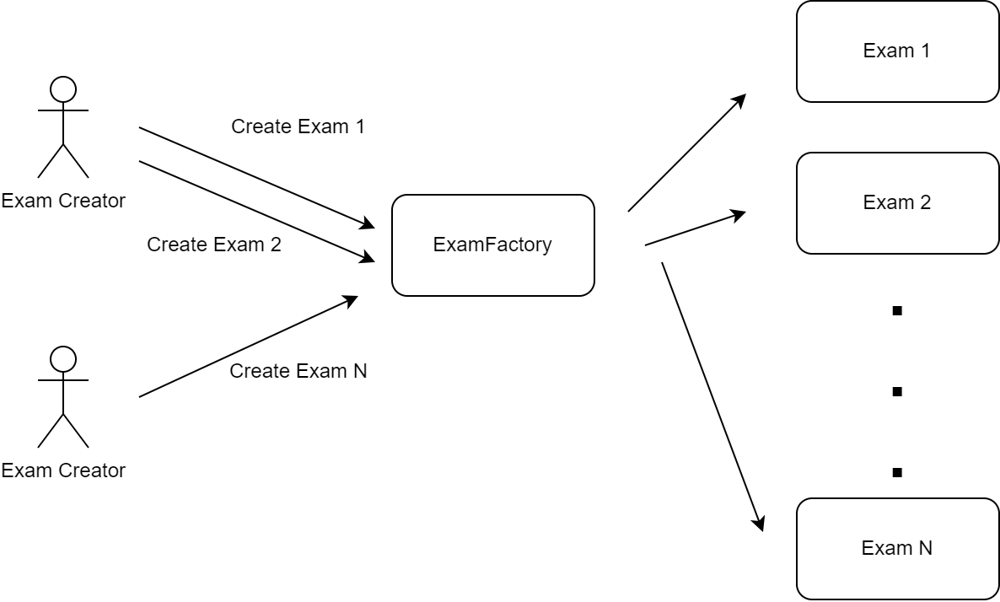
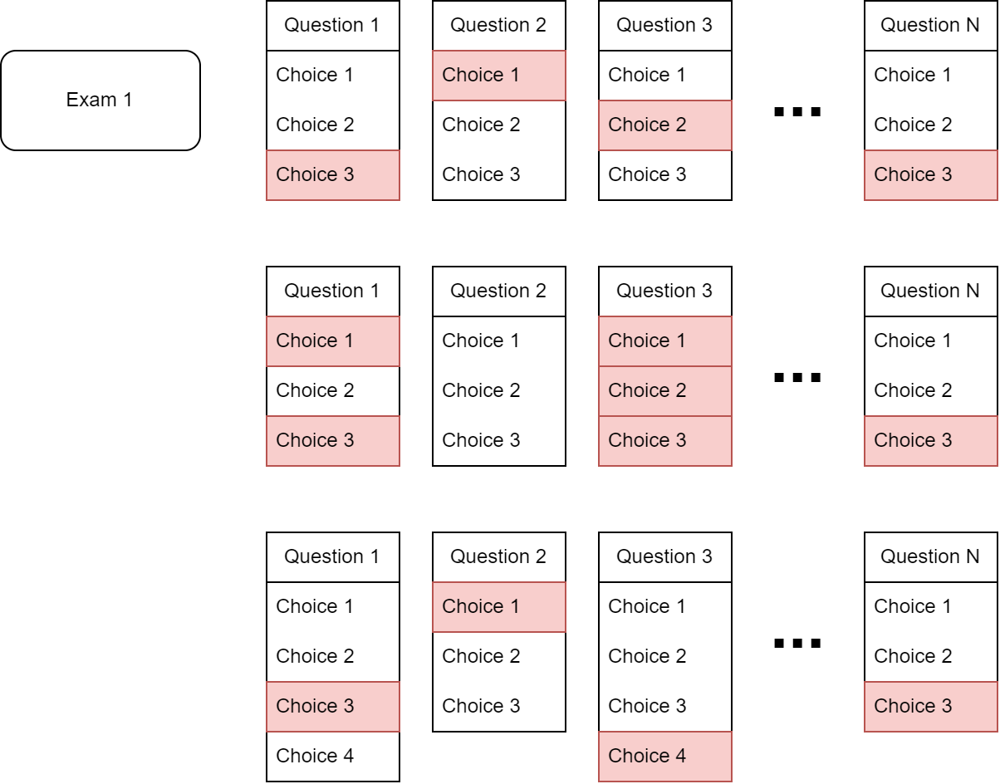
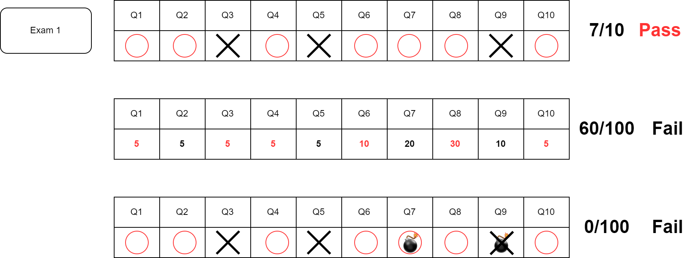
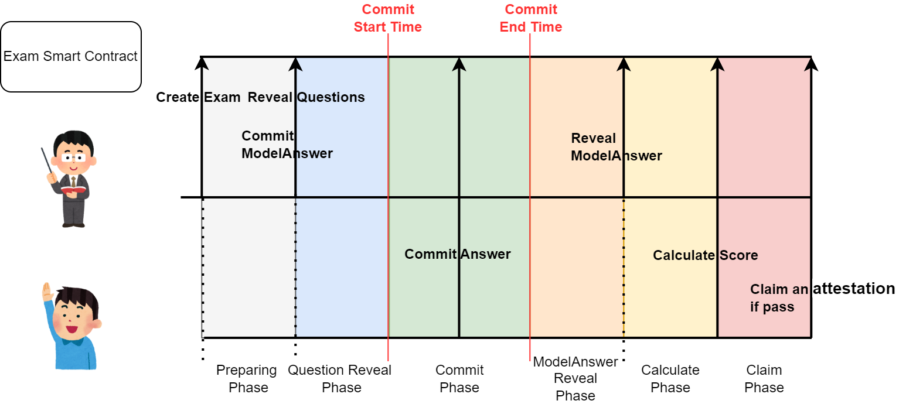
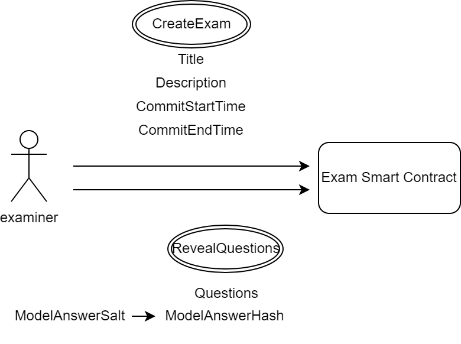
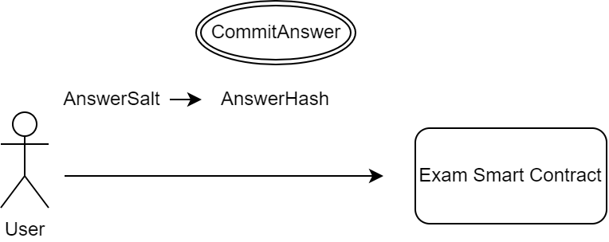
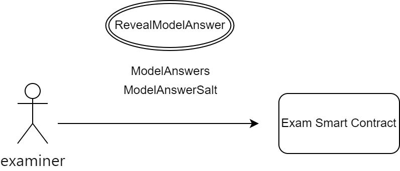
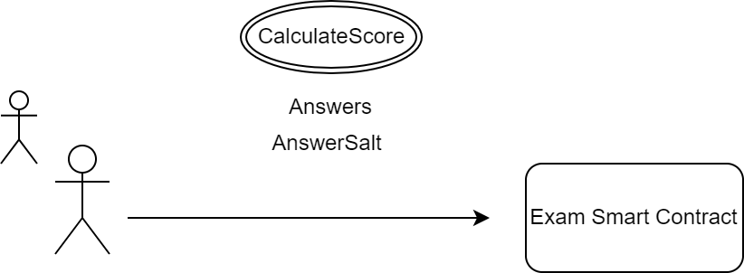
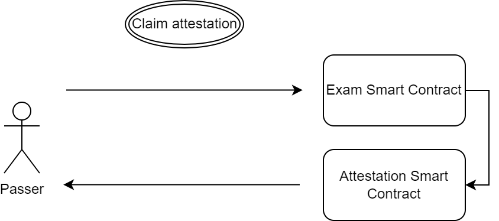

# Core Concept

This protocol handles everything from taking the exam to grading and issuing certificates, all on the smart contract. It manages the questions, model answers, and user answers on the smart contract and issues a digital certificate if the user's answers reach the passing score.

## Protocol Structure

### Create Exam Overview

The Onchain Examination Protocol is a permissionless protocol that allows anyone to create any number of exams. Through the Exam Factory Contract, various types of exams (detailed below) can be created on the blockchain.



### Exam Question & Answer Patterns

Existing online exams have various question formats. In the minimal implementation (V1) of this Onchain Examination Protocol, we will define multiple question formats for multiple-choice questions.

There are several patterns for multiple-choice questions. For example, there can be questions with fixed choices where there is one correct answer each time, questions with multiple correct choices, and questions where the number of choices varies. 



The Exam Contract we envision will accommodate various multiple-choice questions by preparing multiple answer formats in enum type, allowing the examiner to select the optimal format for each question.

```solidity
enum QuestionType {
    RESERVE, // reserved for future use
    MULTIPLE_CHOICE, // 1 byte
    ANSWER_32, // 32 byte
    ANSWER_64 // 64 byte (future support)
}
```

Future upgrades will allow for registering new answer formats on the blockchain, enabling the addition of any desired answer format.

Model answers will be used to determine if the submitted answers are correct.

Example: `{1: ◯, 2: ☓, 3: ◯, 4: ◯, 5: ☓}`

### Exam Pass Patterns

There are various methods for evaluating correct and incorrect answers depending on the exam format.

For example, the simplest method is defining a minimum number of correct answers relative to the total number of questions, where passing is based on meeting or exceeding this number. Another method is weighting points for each question and passing if a score of 70 out of 100 is achieved. Additionally, there could be "bomb questions" where an incorrect answer results in automatic failure.



Since the logic for these evaluations varies by exam, a `pointsMultiplier` variable is prepared for each question, allowing examiners to construct the evaluation logic they deem optimal.

## Protocol Flow



The Onchain Examination Protocol is divided into several phases where examiners and examinees interact through smart contracts.

### Create Exam Flow



First, the examiner registers the exam metadata on the smart contract (`CreateExam`). At this stage, the questions and model answers are not yet registered on the blockchain; only the exam title, description, and submission period are specified.

Next, the examiner reveals the questions (`RevealQuestions`). The questions published on the smart contract become public information and can be immediately displayed on the frontend, allowing examinees to view the questions at this time. However, examinees cannot submit answers yet. The examiner also registers the hash of the model answer with an arbitrary `ModelAnswerSalt` value in the contract to prevent tampering after the exam.

For convenience, the timing of question viewing and answer submission is staggered, but the examiner can set the answer submission phase and question reveal phase to be almost simultaneous.

### Commit Answer Flow



When the answer submission start time (`CommitStartTime`) arrives, examinees can register their answers on the smart contract. At this time, examinees register the hash of their answers, including an arbitrary `AnswerSalt` value, to prevent others from seeing their answers.

When the answer submission end time (`CommitEndTime`) arrives, examinees can no longer submit answers.

During the submission period, examinees can update their answers as many times as they wish.

### Reveal Model Answer Flow



After the submission period ends, the examiner reveals the model answers along with the `ModelAnswerSalt`.

### Calculate Score Flow



When the model answers are revealed, examinees calculate their scores. The `AnswerSalt` used during answer submission is required for this process.

Grading is automatically performed using pre-defined methods on the smart contract.

### Claim Attestation Flow



If the examinee passes the exam, they can claim a digital certificate as proof of passing. We use the [Ethereum Attestation Service (EAS)](https://attest.org/) for certificate services.