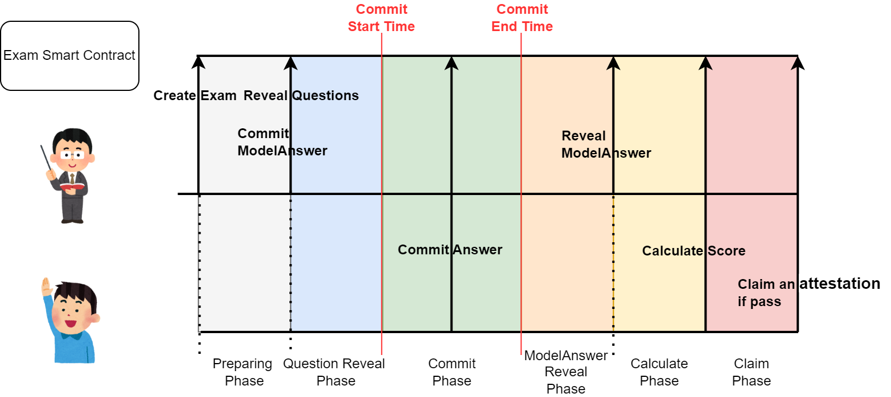
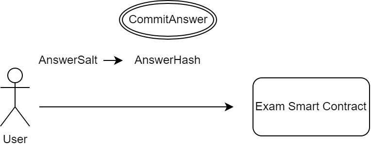
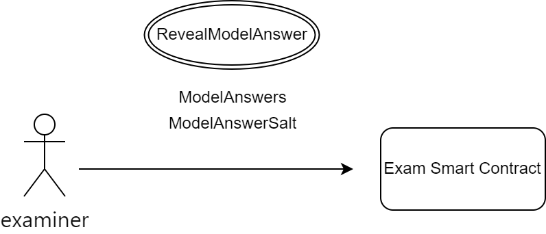
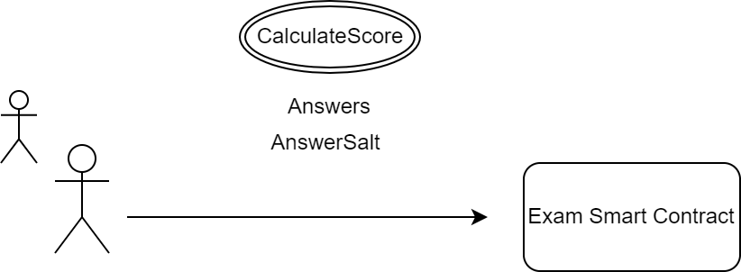

# 仕様

本プロトコルでは、試験の受験から答え合わせ、合格証の発行まで、すべてスマートコントラクト上で行います。スマートコントラクト上で問題と模範解答、ユーザーの解答を管理し、ユーザーの解答が合格点に到達していた場合、デジタル証明書を発行します。

## プロトコルの構造

### Create Exam Overview

Onchain Examination Protocolは、誰でもいくつでも試験を作成することができるPermissionlessなプロトコルになっています。Exam Factory Contractを通じて、様々な形式（後述）の試験をオンチェーン上で作成することができます。

### Exam Question&Answer Patterns

既存のオンライン試験の出題形式は多岐に渡ります。本onchain Examination Protocolの最小限の実装（V1）では、選択肢問題を対象に複数の出題形式を定義できるようにします。

選択式問題の中でも、いくつかのパターンが存在します。例えば、選択肢が固定で正解選択肢が毎回1つの場合や、正解選択肢が複数存在する場合、選択肢の数が問題によって異なる場合などいろいろなパターンが想定されます。

今回想定するExamFactoryでは、様々な選択式問題に対応できるように、複数の出題形式パターンを登録して、出題者が最適な形式を選択できるようにします。また、出題形式パターンとして必要なインターフェースを実装しオンチェーン上で登録することで、任意の出題形式パターンを新たに追加することもできます。(Registry Contractに足していく)

※ 各問題があっているかどうかの判定を行い、正解不正解をそれぞれの問題ごとに出力するところまでが責務になる

例: `{1: ◯, 2: ☓, 3: ◯, 4: ◯, 5: ☓}`

### Exam Pass Patterns

正解不正解の判定に対して、どのような評価を行うかも試験の形式によって様々です。

例えば、一番単純な例だと、問題数に対して、最低正答数を定義して、それ以上なら合格、それ未満なら不合格とする判定方法が考えられます。他にも、問題ごとに点数による重み付けを行い、100点満点中70点以上だと合格のように評価する方法もあります。さらに、爆弾問題を用意して、その問題を間違えると自動的に試験を不合格にするといったオプションを付け足したい場合もあり得ます。

このような評価に関するロジックは試験ごとに異なるため、こちらもパターン化して出題者が最適だと考える評価ロジックを適用する仕組みをプロトコル化します。すでにコントラクトに登録されている評価方法を採用することもできるうえに、独自の評価方法を適応したい場合は、コントラクトに登録することで出題者が任意の評価基準を追加することができます。

※ 入力（{1: ◯, 2: ☓, 3: ◯, 4: ◯, 5: ☓}）に対して、出力(100点中の点数 and 合格不合格)を行うのが責務

## プロトコルの流れ

Onchain Examination Protocolは、いくつかのフェーズに分割され、出題者と受験者がそれぞれSmart Contractを介してやり取りを行います。

### Create Exam Flow

まず、出題者は、スマートコントラクト上に試験のメタデータの登録を行います（`CreateExam`）。この段階では、問題と模範解答はオンチェーン上にはまだ登録されておらず、試験のタイトルや概要、提出期間のみを指定します。

次に、出題者は、問題を公開します（`RevealQuestions`）。スマートコントラクト上で公開した問題は公開情報であり、即座にフロントエンド側で表示されるようになるため、受験者はこのタイミングで問題を閲覧することが可能です。ただし、受験者はまだ解答を送ることはできません。また、出題者は、任意の`ModelAnswerSalt`値を決めて模範解答のハッシュ値をコントラクトに登録しておきます。模範解答のハッシュ値を事前に登録しておくことで出題者が後から解答を変更するような不正ができないようになっています。

便宜上、問題の閲覧タイミングと解答タイミングをずらしていますが、出題者は、解答送信フェーズと問題公開フェーズを（ほぼ）同時に設定することも可能です。

### Commit Answer Flow

解答提出開始時間（`CommitStartTime`）になると、受験者は自分の解答をスマートコントラクト上に登録することができるようになります。このとき、受験者は、他の受験者に自分の解答を知られないように、任意の`AnswerSalt`値を含む、解答のハッシュ値をスマートコントラクト上に登録します。

解答提出終了時間（`CommitEndTime`）になると、受験者は解答を提出することができなくなります。

解答可能な期間中は、受験者は何度でも自分の解答を更新することができます。

### Reveal Model Answer Flow

受験者の解答期間が終わると、出題者は、模範解答を`ModelAnswerSalt`とともに公開します。

### Calculate Score Flow

受験者は、模範解答が公開されると自分のスコアの計算を行います。この際、解答を提出した際に使った`AnswerSalt`が必要になります。

採点は、あらかじめスマートコントラクト上で定義された方法で自動的に行われます。

### Claim Attestation Flow

採点の結果、試験に合格していた場合、受験者は合格証としてのデジタル証明書をClaimすることができるようになります。私たちは、証明書サービスとして[EAS](https://attest.org/)を利用します。
