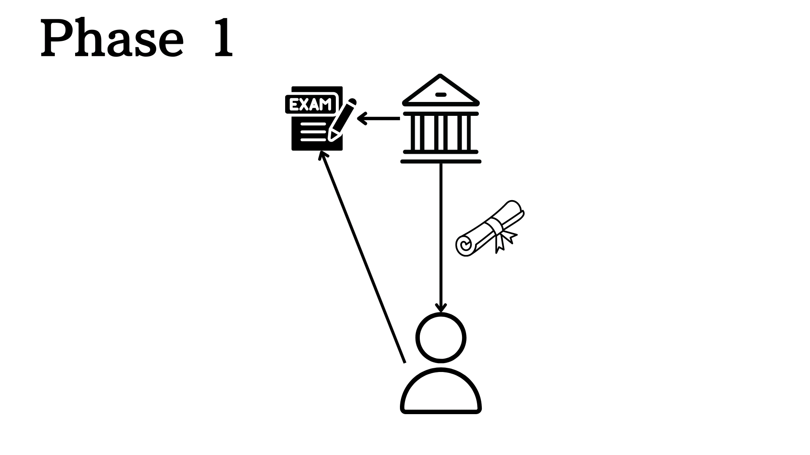

# Welcome to Kiriko - Onchain Examination Protocol

## Welcome

Kiriko - Onchain Examination Protocolは、オンチェーン上での試験を可能にするオープンソースのPublic goodプロジェクトです。

インターネットの世界で誰がどのような知識を持っているのか、どうやって検証しますか？現代のオンライン空間において、急速に発展するAI技術が知識の習得を容易にする一方で、個人が実際にその知識を持っているかを証明する方法は依然として課題となっています。私達には、知識やスキルを持っていることを証明するのに共通の判断基準が必要となります。

また、Web3の世界では、オンチェーン上で人格を形成して分散型の社会活動を可能にする動きが登場しています。

Kirikoは、オンチェーン上で当人が知識やスキルを獲得していることを証明するために実施する試験を標準化したアプリケーションベースレイヤーになります。Kirikoを通して、誰でもいくつでもpermissionlessに試験を作成するとともに、オンチェーン試験を通して自分の知識やスキルを第三者機関に依存することなく証明することができます。さらに、オンチェーン上での個人の知識の習熟度を可視化することでオンチェーン人格の形成に寄与します。

## The trend of Exam and Attestation

これまでの試験を通して当人の知識を証明する流れを振り返ってみます。

まず、大学などのような教育機関では紙の卒業証明書や成績証明書を配布するという原始的なやり方をこれまで行ってきています。現在の証明書の多くは依然としてこの形式に留まっています。(Phase 1)

次に、オンライン上で閲覧可能な証明書を発行する取り組みも行われています。[Udemy](https://www.udemy.com/)や[Coursera](https://www.coursera.org/)では、オンラインDegreeやオンラインのコース修了証を発行するサービスを展開しています。(Phase 2)

オンチェーンの文脈では、[Ethereum Attestation Service (EAS) ](https://attest.org/)が、オンチェーンおよびオフチェーン上での物事に関して証明書を発行できるようにするプロトコルを提供しています。将来的には、特定の機関がEASを利用してオフチェーンのテスト結果などをオンチェーンの証明書として持ってくることができるようになるでしょう。(Phase 3)

Kirikoでは、さらにその次のフェーズとして試験そのものをオンチェーン上で完結できるようにすることで、第三者機関をtrustする部分を完全に排除することができます。(Phase 4) 試験問題や解答結果が改ざんされていないことがスマートコントラクトを使うことで担保することができるとともに、その試験を通して獲得したデジタル証明書は試験結果と明確に紐づいています。

## Why Onchain Matter

なぜ、それほどまでにオンチェーンで行うことにこだわるかというと、Ethereumの創業者である[vitalik Buterin](https://x.com/VitalikButerin)のDecentralized Society (DeSoc) の論文([Decentralized Society: Finding Web3's Soul](https://papers.ssrn.com/sol3/papers.cfm?abstract_id=4105763))にもあるように、オンチェーン上のwalletにSoulを蓄積していき多元的な生き方を許容するDeSocの考え方が今後のインターネットの主流になると考えているからです。

DeSocでは、オンチェーン上にSoulを蓄積していくことでそのアドレスのオンチェーン人格を形成します。

Cryptoの世界では分散金融サービスを中心にtrustlessという考え方が一般的でしたが、オンチェーン人格が形成されるとCryptoの中でもtrustを前提とした多様な経済活動が可能になると考えられます。

例えば、DeFiのlendingではtrustlessのため超過担保が必要ですが、現実世界ではその人の信用情報（名前、住所、就職先など）をもとに銀行は貸付を行います。

Don't Trustの精神が基盤となっているCryptoの世界でも、当人のオンチェーンでの活動履歴に応じて現実世界のようにオンチェーン上でtrustが生まれると、そのtrustに基づいた複雑なサービスが次々と生まれてくるでしょう。

Kirikoでは、特に教育の面からこのオンチェーン人格を基礎としたDeSocに必要なパーツを埋めていきます。その人がどのような知識を持っているかをオンチェーン上のみで判定できるようになると、例えば、オンチェーン上での匿名での採用活動や良質なコミュニティ形成などにも役立てることができます。

私達はDeSocの先にCryptoの未来があると考えているので、Kirikoにおいてもフルオンチェーンにこだわりつつ、誰でも使えるpermissionlessなPublic goodサービスを展開していきます。

## Key Things to Know About Kiriko

### Kiriko creates onchain persona

オンチェーンは次のオンライン空間と言われています。Kirikoは、オンチェーン上でのその人の人格形成に寄与します。Kirikoでは、どのような分野にどの程度詳しいのかを相対的に評価する仕組みをオンチェーン上で実現することが可能になります。

### Kiriko is a part of shaping Desoc

オンチェーン人格が生成された先には、DeSocがあります。Trustlessが基本のブロックチェーンの世界において、trustをベースにした社会構造を作り上げることができます。Kirikoは、教育の面からアドレスへのtrustの蓄積に貢献します。

### Kiriko is a public good

Public Goodという概念は、皆が使う便利なものになります。Kirikoのスマートコントラクトはpermissionlessで誰でも利用することができます。また、試験を作成することで手数料が発生するわけではないので無料で使うことができます。私達のサービスは、多くの善意のスポンサーの皆様のおかげで継続的にサービスをより良いものにしています。

### Kiriko is a community building tool

知識を持っていることを証明できると質の高いコミュニティ形成に役立ちます。コミュニティ内でのプロジェクト教育の一貫としてKirikoのオンチェーン試験を利用したり、オンチェーン試験の結果を分析して新たに趣味嗜好が合う仲間とコミュニティを形成したりと様々な使い方が考えられます。

### kiriko.wtf is a first client

私たちは、Kirikoプロトコルを活用した最初のクライアントアプリケーションとして kiriko.wtf を実装します。

## Join Our Community

1. [Discord](https://discord.gg/YHE4uDCVep)
2. [X (@clc_dao)](https://x.com/clc_dao)
